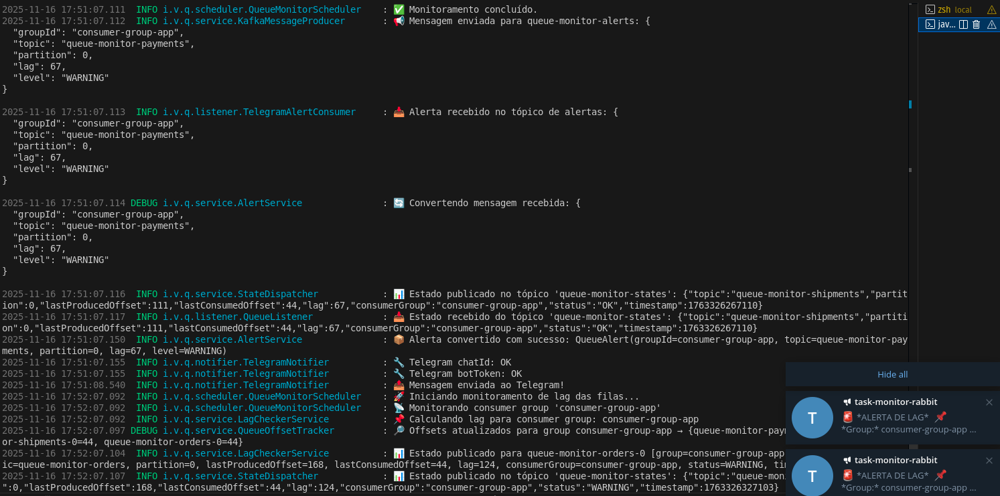

<h1 align="center"> Queue Alert Engine </h1>

  

<!-- ## 📦 queue-alert-engine

`queue-alert-engine` é um sistema criado em Spring Boot para realizar monitoramento de filas Kafka, detectar anomalias e possibilitar o disparo de alertas automáticos (via Telegram, Teams, e-mail etc).
Fornece também endpoints REST para consulta, debug, gatilho manual de monitoramentos e inspeção de offsets — todos documentados automaticamente com Swagger / OpenAPI.
É um projeto simples, didático e extensível, ideal para estudos, PoCs e práticas modernas de DevOps/Observability. -->

## 📦 O Projeto "Queue Alert Engine" 🚦

- O projeto `Queue Alert Engine` (Motor de Alertas de Fila) é um serviço de monitoramento em tempo real focado em checar o atraso (lag) de consumidores em tópicos do Apache Kafka e disparar alertas quando esses atrasos excederem limites configurados.

- Em essência, ele atua como um sistema de vigilância que garante que suas aplicações consumidoras de Kafka estejam processando mensagens em um ritmo saudável.

## 🔑 Funcionalidades Principais

- As principais responsabilidades do projeto são:

1. **Verificação Agendada de Lag**

- Agendamento (`QueueMonitorScheduler`): Utiliza um scheduler (agendador) do Spring (@Scheduled) para rodar verificações de lag em intervalos fixos (ex: a cada 60 segundos).

- Monitoramento (`LagCheckerService`): Usa o AdminClient do Kafka para buscar a posição do último offset produzido (o fim da fila) e o último offset consumido por um grupo específico. A diferença entre eles é o lag.

2. **Definição de Regras e Status**

- O projeto é configurado com `AlertsProperties`, que define grupos de consumidores (groupId) e regras de alerta (AlertRule) para tópicos e partições específicas.

- Status de Lag: O lag verificado é classificado em três níveis:

  - `OK`: Lag aceitável.
  - `WARNING`: Lag excedeu o limite de aviso (lagWarning).
  - `CRITICAL`: Lag excedeu o limite crítico (lagCritical).

3. **Geração e Publicação de Eventos**

- Eventos de Estado (`QueueStateEvent`): O estado atual de cada fila monitorada (incluindo o lag e o status) é publicado em um tópico de estado do Kafka.
- Eventos de Alerta (`QueueAlert`): Quando o status atinge WARNING ou CRITICAL, um evento de alerta é publicado em um tópico de alertas do Kafka.

4. **Notificação via Telegram**

- Consumo de Alertas (`TelegramAlertConsumer`): Um consumidor Kafka escuta o tópico de alertas.
- Envio (`TelegramNotifier`): O alerta é desserializado e formatado. Em seguida, o serviço usa a API do Telegram para enviar a notificação formatada para o chat configurado (chatId).

## 🛠️ Tecnologias Chave

- Framework: Spring Boot (com @EnableScheduling).
- Mensageria: Apache Kafka (usando spring-kafka e AdminClient).
- Configuração: Uso extensivo de @ConfigurationProperties para gerenciar regras de alerta e credenciais (Kafka, Telegram).
- Comunicação Externa: RestTemplate ou WebClient para interagir com a API do Telegram.
> NOTE!
> Em resumo, o projeto é uma solução autônoma e customizável para garantir a observabilidade da performance de consumo em ambientes Kafka.

## 🚀 Roadmap

- [Roadmap de execução do prjeto](./docs/Rodmap.md)

## 🧪 Testar com Kafka Local 

Se quiser rodar Kafka localmente para testar cenários: [Laboratório local](./local/Readme.md)

## 🌐 Fluxo geral do sistema

- [Desenho do Fluxo do serviço](./docs/fluxo.md)

## 📚 Lista dos Endpoints

- [Documentação dos edpoints](./docs/Controllers.md)